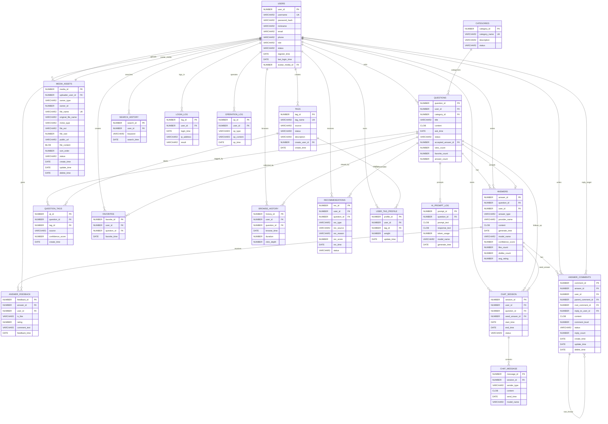

# AI QA ER Diagram Preview

This Markdown wrapper is for VS Code Mermaid preview. Open this file and press `Ctrl+Shift+V` to render the diagram.

```mermaid
erDiagram
    USERS {
        NUMBER user_id PK
        VARCHAR2 username UK
        VARCHAR2 password_hash
        VARCHAR2 nickname
        VARCHAR2 email
        VARCHAR2 phone
        VARCHAR2 role
        VARCHAR2 status
        DATE register_time
        DATE last_login_time
        NUMBER avatar_media_id FK
    }

    CATEGORIES {
        NUMBER category_id PK
        VARCHAR2 category_name UK
        VARCHAR2 description
        VARCHAR2 status
    }

    TAGS {
        NUMBER tag_id PK
        VARCHAR2 tag_name UK
        VARCHAR2 source
        VARCHAR2 status
        VARCHAR2 description
        NUMBER create_user_id FK
        DATE create_time
    }

    MEDIA_ASSETS {
        NUMBER media_id PK
        NUMBER uploader_user_id FK
        VARCHAR2 owner_type
        NUMBER owner_id
        VARCHAR2 file_name UK
        VARCHAR2 original_file_name
        VARCHAR2 mime_type
        VARCHAR2 file_ext
        NUMBER file_size
        VARCHAR2 public_url
        BLOB file_content
        NUMBER sort_order
        VARCHAR2 status
        DATE create_time
        DATE update_time
        DATE delete_time
    }

    QUESTIONS {
        NUMBER question_id PK
        NUMBER user_id FK
        NUMBER category_id FK
        VARCHAR2 title
        CLOB content
        DATE ask_time
        VARCHAR2 status
        NUMBER accepted_answer_id FK
        NUMBER view_count
        NUMBER favorite_count
        NUMBER answer_count
    }

    ANSWERS {
        NUMBER answer_id PK
        NUMBER question_id FK
        NUMBER user_id FK
        VARCHAR2 answer_type
        VARCHAR2 provider_name
        CLOB content
        DATE generate_time
        VARCHAR2 model_name
        NUMBER confidence_score
        NUMBER like_count
        NUMBER dislike_count
        NUMBER avg_rating
    }

    QUESTION_TAGS {
        NUMBER qt_id PK
        NUMBER question_id FK
        NUMBER tag_id FK
        VARCHAR2 source
        NUMBER confidence_score
        DATE create_time
    }

    ANSWER_FEEDBACK {
        NUMBER feedback_id PK
        NUMBER answer_id FK
        NUMBER user_id FK
        VARCHAR2 is_like
        NUMBER rating
        VARCHAR2 comment_text
        DATE feedback_time
    }

    ANSWER_COMMENTS {
        NUMBER comment_id PK
        NUMBER answer_id FK
        NUMBER user_id FK
        NUMBER parent_comment_id FK
        NUMBER root_comment_id FK
        NUMBER reply_to_user_id FK
        CLOB content
        NUMBER comment_level
        VARCHAR2 status
        NUMBER reply_count
        DATE create_time
        DATE update_time
        DATE delete_time
    }

    FAVORITES {
        NUMBER favorite_id PK
        NUMBER user_id FK
        NUMBER question_id FK
        DATE favorite_time
    }

    BROWSE_HISTORY {
        NUMBER history_id PK
        NUMBER user_id FK
        NUMBER question_id FK
        DATE browse_time
        NUMBER duration
        NUMBER click_depth
    }

    SEARCH_HISTORY {
        NUMBER search_id PK
        NUMBER user_id FK
        VARCHAR2 keyword
        DATE search_time
    }

    RECOMMENDATIONS {
        NUMBER rec_id PK
        NUMBER user_id FK
        NUMBER question_id FK
        VARCHAR2 rec_type
        VARCHAR2 rec_source
        VARCHAR2 rec_reason
        NUMBER rec_score
        DATE rec_time
        VARCHAR2 status
    }

    USER_TAG_PROFILE {
        NUMBER profile_id PK
        NUMBER user_id FK
        NUMBER tag_id FK
        NUMBER weight
        DATE update_time
    }

    CHAT_SESSION {
        NUMBER session_id PK
        NUMBER user_id FK
        NUMBER question_id FK
        NUMBER seed_answer_id FK
        DATE start_time
        DATE end_time
        VARCHAR2 status
    }

    CHAT_MESSAGE {
        NUMBER message_id PK
        NUMBER session_id FK
        VARCHAR2 sender_type
        CLOB content
        DATE send_time
        VARCHAR2 model_name
    }

    AI_PROMPT_LOG {
        NUMBER prompt_id PK
        NUMBER question_id FK
        CLOB prompt_text
        CLOB response_text
        NUMBER token_usage
        VARCHAR2 model_name
        DATE generate_time
    }

    LOGIN_LOG {
        NUMBER log_id PK
        NUMBER user_id FK
        DATE login_time
        VARCHAR2 ip_address
        VARCHAR2 result
    }

    OPERATION_LOG {
        NUMBER op_id PK
        NUMBER user_id FK
        VARCHAR2 op_type
        VARCHAR2 op_content
        DATE op_time
    }

    USERS ||--o{ TAGS : creates
    USERS ||--o{ MEDIA_ASSETS : uploads
    MEDIA_ASSETS ||--o{ USERS : avatar_media

    USERS ||--o{ QUESTIONS : asks
    CATEGORIES ||--o{ QUESTIONS : categorizes
    QUESTIONS ||--o{ ANSWERS : has
    USERS ||--o{ ANSWERS : writes
    QUESTIONS ||--o| ANSWERS : accepts

    QUESTIONS ||--o{ QUESTION_TAGS : tagged_by
    TAGS ||--o{ QUESTION_TAGS : labels
    USERS ||--o{ USER_TAG_PROFILE : owns
    TAGS ||--o{ USER_TAG_PROFILE : profiles

    ANSWERS ||--o{ ANSWER_FEEDBACK : receives
    USERS ||--o{ ANSWER_FEEDBACK : gives
    ANSWERS ||--o{ ANSWER_COMMENTS : has
    USERS ||--o{ ANSWER_COMMENTS : writes
    USERS ||--o{ ANSWER_COMMENTS : reply_target
    ANSWER_COMMENTS ||--o{ ANSWER_COMMENTS : parent_child
    ANSWER_COMMENTS ||--o{ ANSWER_COMMENTS : root_thread

    USERS ||--o{ FAVORITES : creates
    QUESTIONS ||--o{ FAVORITES : collected_by
    USERS ||--o{ BROWSE_HISTORY : browses
    QUESTIONS ||--o{ BROWSE_HISTORY : viewed_by
    USERS ||--o{ SEARCH_HISTORY : searches

    USERS ||--o{ RECOMMENDATIONS : receives
    QUESTIONS ||--o{ RECOMMENDATIONS : recommended

    USERS ||--o{ CHAT_SESSION : starts
    QUESTIONS ||--o{ CHAT_SESSION : follows_up
    ANSWERS ||--o{ CHAT_SESSION : seed_answer
    CHAT_SESSION ||--o{ CHAT_MESSAGE : contains

    QUESTIONS ||--o{ AI_PROMPT_LOG : prompts
    USERS ||--o{ LOGIN_LOG : logs_in
    USERS ||--o{ OPERATION_LOG : operates
```
